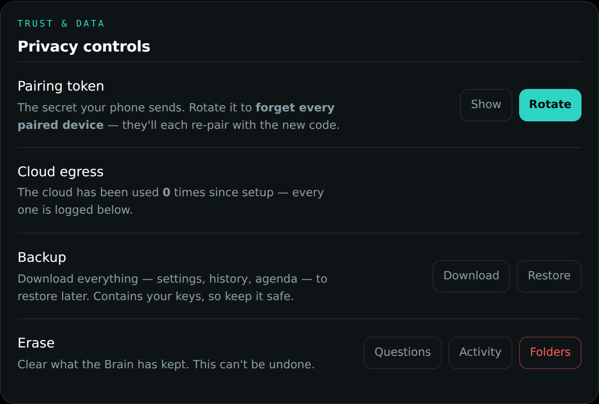
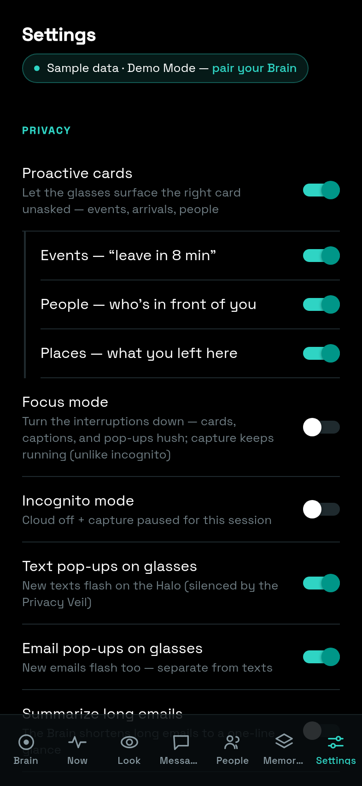

# Privacy and control

Privacy is not a settings page in DreamLayer; it is the architecture. This
chapter collects every control and every invariant, from the one-gesture veil
to the byte-level rules about what may leave your hardware.

## The Privacy Veil

One long press and the glasses go **fully deaf and blind** — nothing seen,
heard, or kept — until you lift it. Technically: `pause()` closes the
`PrivacyGate`, and every capture-adjacent path in the orchestrator checks
`privacy.allow_capture()` before doing anything.

Gated by the veil: scene and conversation ingest, live captions and the
ledger, the user model's learning, commitment capture, anticipation cards,
harks, message pop-ups, dossiers and greetings, the Social Lens ear and eye
(both `identify` and introduction offers), Truth Lens feeds, Veritas world
checks, answer-ahead, object look-ups, waypath, brain asks, profile
publishing, and place triggers. Introductions, meetings and name rehearsal are
gated too — enrolling a name is a write, and the shield stops writes, not just
reads. So are the Brain's question/answer history, the glance arbiter's learned
priors, and any model request to an endpoint that is not on this machine (a LAN
Ollama box is another computer; a request to it is counted and logged like any
other egress). The Horizon keeps rendering — but only the empty paused frame.

Two honest limits, stated rather than implied. Voice **commands** still work
under the shield — "incognito off" has to be sayable, or a wearer who turned it
on by voice would be stuck. And a full `pause()` gesture is a separate flag from
the incognito session shield: leaving incognito never silently clears an explicit
pause, so the gesture is its own way back.

The veil is also honored *aesthetically*: the PrivacyVeilCard enters with a
slam (no pane, no pretty fade), parallax freezes to zero on the exact frame
the veil lands, and lifting it requires the same deliberate long press.

What the veil does **not** block: asking about memories that were lawfully
kept before the veil dropped (`recall_conversation` is user-initiated), and
resuming.

## Incognito versus Focus — two different silences

| | **Incognito** | **Focus** |
|---|---|---|
| What it means | a private stretch | do-not-disturb |
| Capture | **paused** | keeps running |
| Cloud | **forced off** (preference restored after) | unchanged |
| Interruptions | (capture is off anyway) | held — cards, captions, pop-ups; urgent watch-outs still pierce |
| Set by | phone toggle, panel toggle, "Hey Juno, go incognito" | phone toggle, "Hey Juno, focus mode" (default 25 minutes) |

On the Brain, incognito maps to `network_mode: "lan_only"`, which hard-fails
`cloud_ready()` — no cloud call can be assembled while it holds. Quiet hours
(below) produce the same state on a schedule.

## Consent moments

- **Face recall** — a versioned consent (`BrainConfig.face_consent_version`,
  currently `2026-07-29.auto-enrol.v1`) the wearer must accept before any face
  is embedded, matched or stored. `identify` returns `no-consent` and `enrol`
  refuses, both *before* the embedder is reached, so without acceptance no
  template is computed at all (`test_without_consent_nothing_runs`). The text
  names what it is: templates are biometric identifiers; with
  `face_auto_enrol` on they include people who have not agreed and cannot
  agree here — bystanders, passers-by, anyone in frame; collecting biometric
  identifiers without the subject's consent is restricted or unlawful in some
  places (Illinois' BIPA, GDPR Article 9). An acceptance is recorded against
  one exact version, so a stale acceptance does not count and new terms
  re-prompt instead of inheriting the old one
  (`test_a_stale_consent_version_does_not_count`) — keeping the version in
  step with the words is a discipline on us, not something the code detects.
  Withdrawing consent stops recall immediately and deletes nothing:
  `revoke_consent` reports how many faces are still held so an erase can be
  put beside it, and erasing is the separate deliberate act (`forget_all`, and
  erase-everything, which reaches the face index). **This is the wearer's
  consent, not the subject's.** No flow here can obtain a bystander's
  agreement, and we do not claim it does — the wearer is accepting a risk on
  their behalf. Two limits stated rather than implied: today this consent
  lives on the Brain (`GET /dreamlayer/face` returns the version and the exact
  text, `POST /dreamlayer/face/consent` accepts or withdraws) — the phone and
  panel screens that render it are not built yet, so there is no prompt a
  wearer meets by tapping around. And it is off three times over on a fresh
  install: `face_recognition` is False, `face_auto_enrol` is False, and the
  face model ships in no deployment profile (`pip install dreamlayer[face]`),
  so a default install has no weights and declines every frame.
- **Name capture** — a name is kept only from a closed, offline grammar of
  self-introductions ("Hi, I'm Maya" — never ambient chatter, never a
  bystander), saved automatically the moment it is given; the veil closes
  the ear, and "forget that" erases it.
- **ConsentRequiredCard** — a new data source stops the world until you say
  yes.
- **Private zones** — places you mark never-record; entering one shows the
  PrivateZoneCard.
- **Forget** — "forget that" erases the last capture and confirms with the
  ForgetLastCard.

|  |  |  |
|---|---|---|

## The three brain switches

No "mode dial" — three independent switches, exposed identically by the
phone and the Mac panel:

| Switch | What it does | Default |
|---|---|---|
| **Mac mini** (`connect_mac_mini`) | upgrades the local brain to the Mac's bigger model plus your indexed files | off — the phone is the brain |
| **Cloud** (`use_cloud`) | frontier reach for the hardest, non-personal asks | off — opt in when you want it |
| **Incognito** (`set_incognito`) | forces cloud off and pauses capture for the session | off |

The rule of thumb the architecture enforces: **everything that is yours —
memory, people, your files, naming objects — works with cloud off.** The
cloud only adds reach for hard, non-personal asks, and it is never consulted
for Social Lens, memory, or anything marked private, in any configuration.

## Egress: counted, logged, visible

There is exactly one place data can leave your hardware — the Brain's cloud
call — and it cannot happen silently:

- Every cloud answer increments a lifetime `cloud_calls` counter (persisted
  in config, surfaced in `/dreamlayer/status`, shown in the panel's Privacy
  section and egress line).
- Every call writes a `cloud-egress` activity entry with the query's first 70
  characters, visible in the panel's Activity feed and the phone's Recent
  activity.
- Answers carry their tier, so a cloud-tier answer is always attributable.

## Nothing sends silently

Outbound messages (iMessage or Mail via the Brain) follow a strict draft,
approve, send flow: `POST /dreamlayer/message/draft` returns the exact
script for preview; `POST /dreamlayer/message/send` refuses anything without
`approved: true`, and is local-only besides. The phone's Messages tab wires
the "Approve and send" button to exactly this.

## Local-only endpoints

Anything exposing secrets, the filesystem, or outbound action answers only
from the machine itself (403 from off-box): the pairing token and code, the
folder browser, backup and restore, clearing data, token rotation, cloud
connection tests, model pulls, and message sends.

## Retention, quiet hours, and the vault

- **Quiet hours** (`"22:00-07:00"` style, wraps midnight) put the Brain into
  scheduled incognito — cloud off for the window.
- **Retention days** prune the ask history and activity log on boot (0 keeps
  forever).
- **The memory lifecycle** runs on its own windows, separate from that setting:
  sightings older than 24 hours and memories older than 90 days are deleted at
  startup and hourly thereafter. People, promises, tasks, taught facts and
  places are cold — kept until you forget them — and a pinned row never
  expires. A row whose age cannot be read is kept, not guessed at.
- **Backup** is a full restorable snapshot (config including secrets,
  history, activity, agenda) — local-only to download, local-only to
  restore. **Erase** clears questions, activity, or folders selectively.
- **Structured memory, never raw:** DreamLayer stores meaning — labels,
  places, lines of text, embeddings' conclusions — not audio or video
  recordings. One stored thing is named separately, because it is different in
  kind: with the opt-in `face` pack and its weights installed, the versioned
  consent accepted, and the face-recall switch on, a 512-dimension face
  template is written for each stored identity to `face_index.json` beside the
  config (chmod'ed to 0600 after every write), along with that identity's name
  if it has one and how often and when it was last seen. That template is a
  biometric identifier, not a description of one. With `face_auto_enrol` on, a
  template is stored for the subject of a frame even when they match nobody —
  often someone who never agreed and cannot agree in the app — not only for
  people you introduced; unnamed ones age out on the 90-day warm window, named
  ones are kept until you erase them. Only one face per frame is ever
  templated, the largest and most central, and only if it fills at least a
  tenth of the frame's shorter side: a bystander in the background is detected
  but never templated. No image, crop, bounding box or landmark is written to
  disk or to a log; no template leaves this machine (backup and encrypted sync
  carry config, history, activity and agenda — not the face index); and
  erase-everything deletes the file.

## The phone's privacy surface

Every switch above, plus per-channel pop-up controls and capture pause, in
one Settings group:

## Deliberately not built

No public face database and no cloud face search, **no cloning of anyone's voice
but Juno's**, no covert recording. See `docs/PRIVACY_MODEL.md` for the standing
threat model.

Those are absent from the codebase, not switched off: no code path queries an
outside face service — the recogniser loads local weights and never reaches the
network on a recall path — and continuous, un-prompted recognition is refused
outright in a release build no matter what the environment says
(`face_live.ambient_allowed`).

Face *recognition* used to be on that list and no longer belongs there, so it is
stated here rather than quietly dropped. It is built, and we will not blur the
two. A real recogniser is in the tree: InsightFace `buffalo_l` (SCRFD detect +
ArcFace r50, 512-d, ONNX/CPU) in `truth_lens/face_backends.py`. What keeps it
quiet is a chain of switches — exactly what this page used to say it was not.
The `face` extra is in no deployment profile
(`test_the_face_pack_is_in_no_deployment_profile` fails the build if it ever
enters one), the weights must be on disk and pass their integrity check,
`face_recognition` is off on a fresh install, and the versioned consent must be
accepted before the Brain's face routes put a single frame through the model.

With all of those satisfied it answers one question — "is this one of the people
I introduced?" — and a template that matches nobody is discarded on the spot,
never stored, never logged, never in the ledger. One switch further,
`face_auto_enrol` (off by default), changes that answer: a face that matches
nobody is stored instead, so it is recognised next time. That includes a
bystander who never agreed and cannot agree here, and the consent gating it is
the **wearer's**, accepted on the subject's behalf — the consent text says so in
those words, and names biometric templates, BIPA and GDPR Article 9 outright.
Such identities are kept unnamed rather than given a fabricated name, age out on
the 90-day warm window unless the wearer names them, and erase-everything
reaches every one of them.

True in every configuration: the Veil stops capture before the model runs, only
the subject's face is embedded (a passer-by in the background is detected, never
templated), no template ever leaves the device, and erase-everything deletes
every stored face.

The voice line needs one sentence more, because a blanket "no voice cloning"
would be false and we would rather be precise than absolute. A voice-cloning
engine (XTTS) *is* in the tree, behind an opt-in extra, and it exists for exactly
one purpose: so Juno can speak in *her own* voice offline instead of a stock
robot one. The only place the product builds it points the reference clips at her
baked `juno_*.mp3` takes, hard-coded. **No microphone audio, no recording of you,
and no recording of anyone near you is ever used as a voice reference** — there is
no code path that would accept one. That is the promise worth making, and it is
the one the code keeps; `test_advertised_claims.py` fails if it stops being true.
